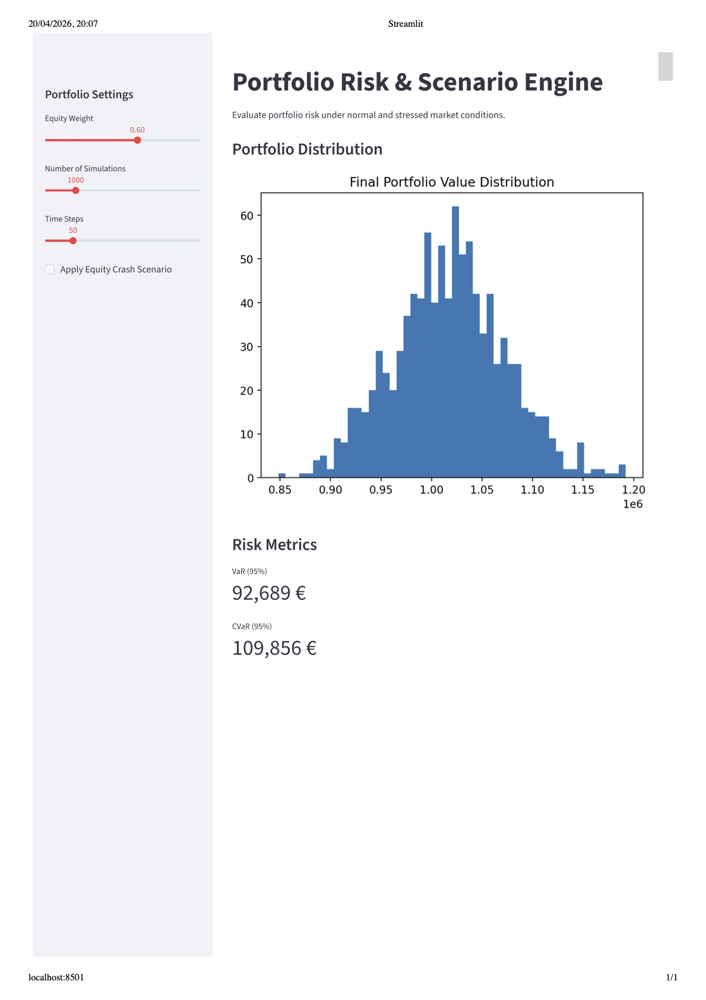

# Portfolio Risk & Scenario Engine

A Monte Carlo-based risk analytics tool designed for portfolio managers and family offices to evaluate downside risk under realistic market conditions.

---

## Key Features

- Monte Carlo simulation of multi-asset portfolios  
- Correlated returns modeling (multivariate Gaussian)  
- Risk metrics:
  - Value at Risk (VaR)
  - Conditional VaR (CVaR)
  - Maximum Drawdown  
- Stress testing:
  - Equity market crash (-20%)
  - Volatility shocks  
- Interactive dashboard (Streamlit)

---

## Example Output

- VaR (95%): €88,997  
- CVaR (95%): €109,241  
- Scenario loss (equity crash): ~€122k on €1M portfolio  

## Dashboard Preview



---

## Motivation

This project focuses on practical portfolio risk management, emphasizing:

- downside protection  
- scenario-based analysis  
- decision-relevant metrics  

Designed with real-world use cases in mind for:
- family offices  
- private wealth managers  
- risk analysts  

---

## Project Structure

```
core/        # portfolio logic, simulation, risk metrics  
scenarios/   # stress scenarios  
app/         # Streamlit dashboard  
tests/       # unit tests  
docs/        # LaTeX technical documentation  
```

---

## Run the Dashboard

```bash
pip install -r requirements.txt
PYTHONPATH=. streamlit run app/dashboard.py
```

---

## Documentation

A full mathematical and technical description is available in:

```
docs/portfolio_risk_engine.tex
```

---

## Tech Stack

- Python  
- NumPy  
- Streamlit  
- Matplotlib  

---

## Author

Robin Basso  
PhD in Fluid Mechanics | Quantitative Developer

---

## Note

This project is designed as a decision-support tool, not a trading system.